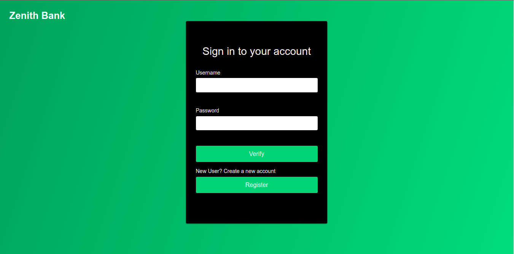
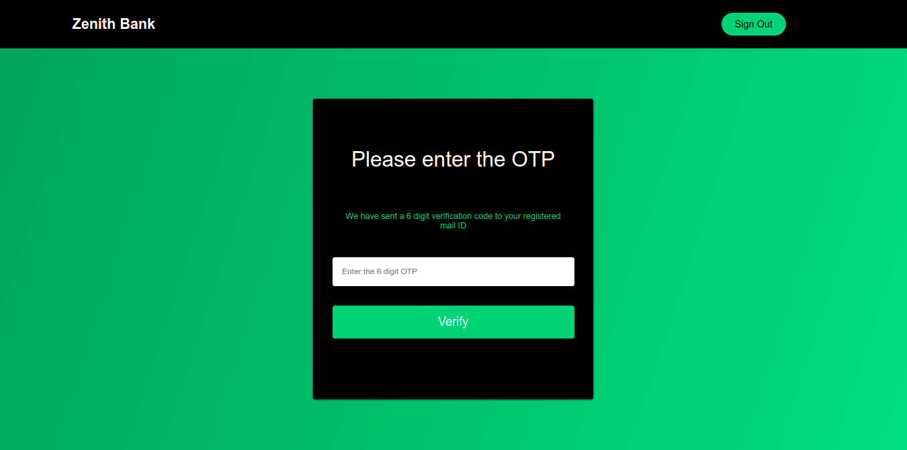
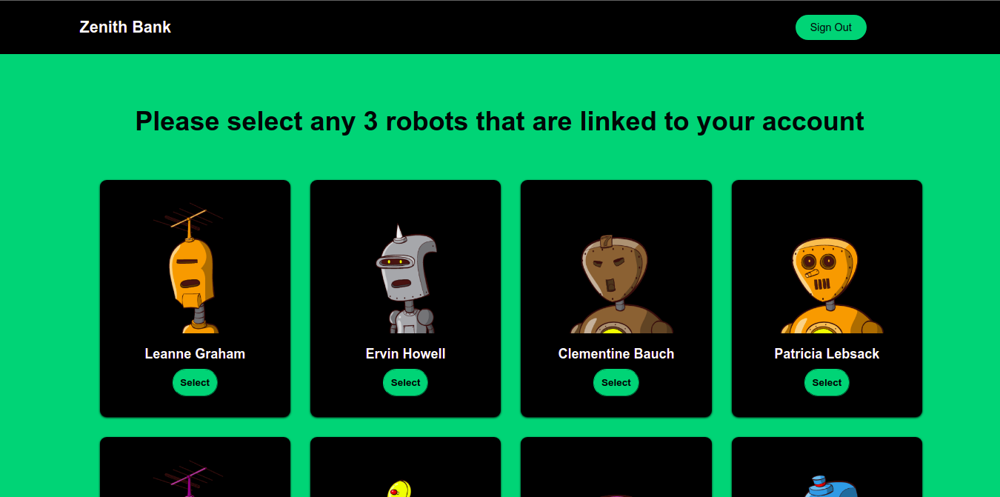
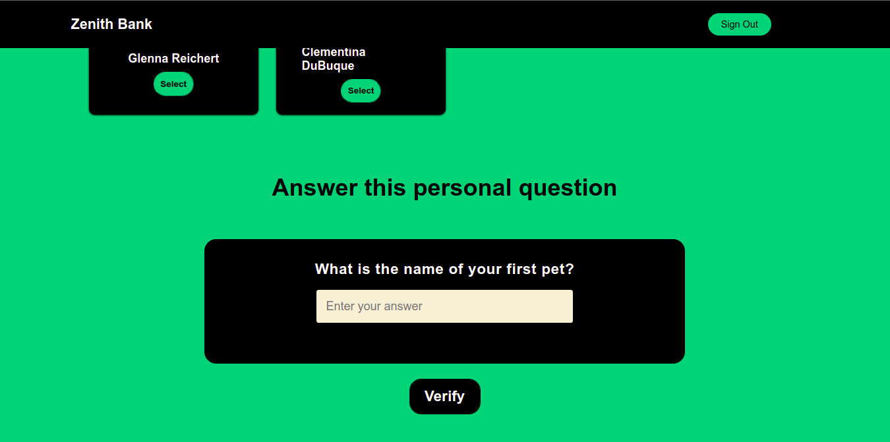

# :dollar: E-Banking using Three-Factor Authentication (3FA)

Name: Zenith Bank  
Developers: Ankesh Singh (@ankeshh), Nevin Troy (@NevinTroy)

***

## **I. Abstract**

In this project we propose an online banking system, which is user-friendly and secure. The main aspect of the project for us is to provide basic functionality of a bank in a secure manner, we propose using a Three-factor authentication system. Many online systems use two-factor authentication systems and there have beenmany cases and studies done where the two-factor systems were able to be bypassed, so we intended to add another level of security, so as to further secure our banking system and provide users with peace of mind when performing online transactions and while dealing with their personal accounts and information.

## **II. Introduction**

In the current state of the world, physically going to a bank outlet has become increasingly difficult as well as dangerous, this  has given rise to a large increase in online banking systems around the world. An Online banking system is a simple User Interface aiming to provide essential banking features, we aim to design a system that is simple and comprehensible to any customer. A user will be able to login as either an admin or customer, both having different privileges and permission within the system.
The main goal for us is to be able to perform crucial tasks such as money transfers and taking deposits, through online transactions, all of which will be done using a secure system. We are implementing a three-factor authentication system for all users.

A customer is validated using:

1. Customer’s password
2. A One-time password which is sent to the Users Email, and
3. By selecting three images that was decided upon by the customer at the time of registration

## **III. Authentication Layers**

Our Online banking interface has three layers of authentication: signup using password, Time based OTP via Email and image recognition. We use protected routes to ensure that users cannot access bank features via url once they have signed out. If a user tries to access the ‘/transaction’ feature via url if they’re not signed in, the application will redirect them to the sign in
page.

### **First Layer of Authentication**

The first layer of authentication is a sign up page that contains two fields: username and password. If the incoming user is a new
user, they can register themselves and their details will be stored in the database. The passwords of the users are hashed using
bcrypt which uses blowfish cypher and hashes the users passwords with a random salt value generated by the backend.

### **Second Layer of Authentication**

The second layer of authentication is a One Time Password. The otp is generated by the backend. Each time a user enters the system, a new token is generated which is hashed using SHA-256 algorithm and stored in the database. If a new user uses the application a new token is inserted into the database. If an existing user uses the application, the token gets updated. Using the user’s token we generate a TOTP (Time based One Time Password) which has a lifetime of 30 seconds and a window of 1. This window of 1 specifies that the previous OTP sent by the backend is still valid if the user runs out of time. This OTP is sent to the user via mail. The user then retrieves the OTP and pastes it in the field. This OTP is validated against the backend and if it is the right OTP, then the user gets redirected to the third layer of authentication.

### **Third Layer of Authentication**

The third layer of authentication is knowledge-based image recognition and a security question. The user will be prompted to choose any 3 out of 5 correct robot from a set of 10 differenet robots. The selections are to be hashed with the security answer and stored in the database. The user is expected to remember all these robots for their banking authentication. An email will be sent to the user after they’ve selected these images during the registration phase, which will contain the images they’ve selected and this will be sent only once during the registration phase.

## **Site Functionalities**

- Login/Register New User
- User Account Management
- Account Details
- Add/Delete Account
- Beneficiary
- Money Transfer
- Credit Card/Debit Card
- Message/Notification service
- History of Transactions
- Loction Service using Google Maps API

## **Potential Issues**

1. Email compromised
    - If a user’s email is compromised an attackers will be able to intercept the OTP and negate the first actor of the authentication system

2. Brute-force attack
    - The sample size of the images that can be selected in relatively small so an attacker could run a brute force attack and identify the images that the user had chosen.

3. Real-time deployment
    - In Real-time deployment of a three-factor authentication system, it could suffer from security risks due to bad design or underestimating the severity of client-side attacks. Advances to the system that could be addressed in future works on the topic of multi factor authentication is the use of Out-Of-Band channels. Which will allow a user to be authenticated by being able to communicate with the authentication servers through the OOB Channel.
